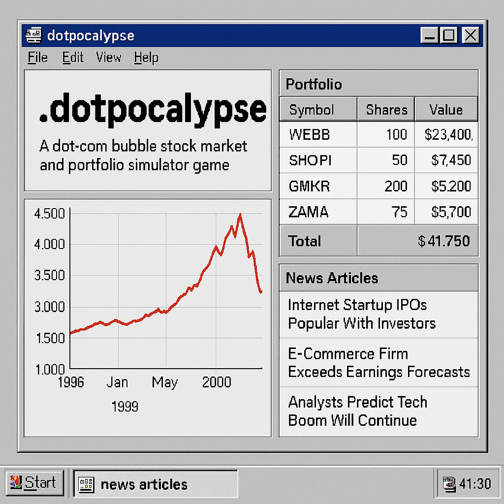
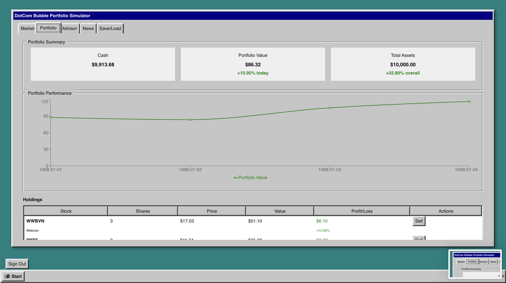
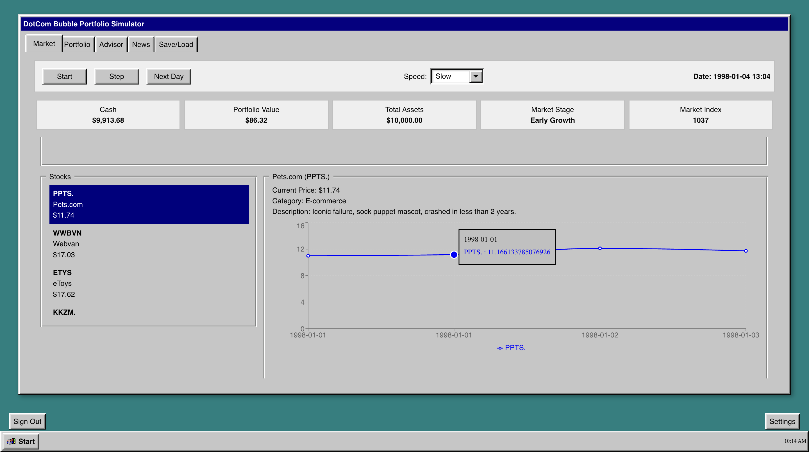
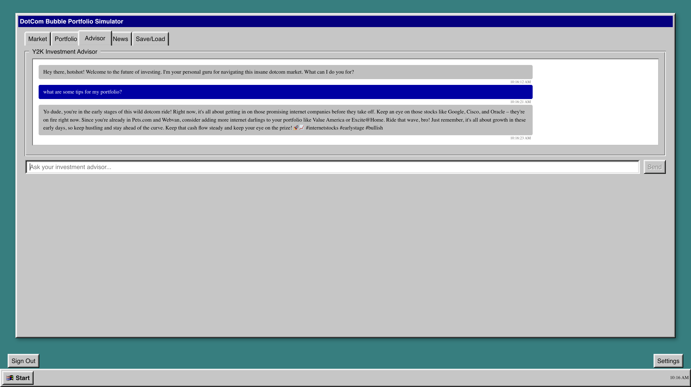

# 💻 Dotpocalypse: Dotcom Bubble Portfolio Simulator 📈📉

Imagine it's 1998 and you're given a Bloomberg Terminal and ChatGPT. Can you survive the infamous crash of the dot-com bubble?

Dotpocalypse is a Windows 98-themed stock market simulator that recreates the dotcom bubble era, complete with an AI investment advisor and realistic market mechanics. 💰 🚀 💥



## ✨ Features

- 🖥️ **Authentic Windows 98 UI**: Experience the nostalgia of late 90s computing with pixel-perfect Windows 98 styled components
- 📊 **Realistic Dotcom Bubble Simulation**: Watch the market progress through early growth, mania, peak, and eventual crash phases
- 🤖 **AI Investment Advisor**: Get advice from a Y2K-era Wall Street finance bro powered by OpenAI
- 📰 **Dynamic News Headlines**: AI-generated news that impacts stock prices and reflects market conditions
- 💼 **Portfolio Management**: Buy and sell stocks, track performance, and analyze your investment strategy
- 💾 **Save Progress**: Create an account to save and load your game sessions
- 🏛️ **Historical Accuracy**: Features real companies from the dotcom era with realistic behavior patterns

## 🕹️ Gameplay

### 💼 Portfolio Management


Track your holdings and make strategic investments with the Windows 98 interface. Your net worth graph shows if you're becoming the next dotcom millionaire—or if you'll lose everything when the bubble bursts.

### 📊 Market Overview


Watch the dotcom market evolve through boom and bust. Stocks respond to news, sentiment, and market conditions. Spot trends and time your investments to maximize returns before the inevitable crash.

### 🤖 AI Investment Advisor


Get tips from your Y2K-era Wall Street advisor. This AI character offers advice that might be brilliant—or catastrophically wrong. The advisor becomes increasingly euphoric as the bubble grows, mirroring the real-world hubris of the era.

## 🛠️ Technology Stack

- ⚛️ **Frontend**: React with TypeScript
- 🎨 **UI Components**: React95 for Windows 98 styling
- 📈 **Charts**: Recharts for data visualization
- 🔐 **Authentication**: Supabase for user management
- 🧠 **AI Integration**: OpenAI API for the investment advisor and news generation
- 💽 **Data Persistence**: Supabase for saving game progress

## 🎮 Game Mechanics

### 📅 Market Stages

The dotcom bubble simulation progresses through several stages:

1. 🌱 **Early (1997-1998)**: Initial growth of internet companies
2. 📈 **Growth (1998-1999)**: Accelerating adoption and investment
3. 🚀 **Mania (1999-2000)**: Extreme enthusiasm and speculation
4. 🏔️ **Peak (Early 2000)**: Maximum market valuation
5. 📉 **Decline (Mid 2000)**: Initial signs of trouble
6. 💥 **Crash (2000-2004)**: The bubble bursts

### 📊 Stock Behavior

Stocks have different characteristics that affect their behavior:

- 🏷️ **Category**: E-commerce, Search, Social Media, etc.
- 🎢 **Volatility**: How much the stock price fluctuates
- 🛡️ **Survival Chance**: Likelihood of surviving the crash

### 📝 Investment Strategy

To succeed in the game:

- 🔍 Identify promising companies in the early stages
- 🌊 Ride the wave during the mania phase
- ⚠️ Recognize warning signs before the crash
- 🧩 Diversify your portfolio across different sectors
- ⏱️ Time your exit before the bubble bursts

## ⚙️ Customization

You can adjust various simulation parameters in the Settings panel:

- 📅 Starting year and month
- 📊 Market volatility
- 🎲 Crash randomness
- ⏱️ Time scale

## 📁 Project Structure

```
dotpocalypse/
├── assets/                   # Application images and resources
├── public/                   # Static files
└── src/                      # Source code
    ├── components/           # React components
    │   ├── advisor/          # AI advisor components
    │   ├── auth/             # Authentication components
    │   ├── layout/           # Layout components
    │   ├── portfolio/        # Portfolio management components
    │   ├── simulation/       # Simulation components
    │   └── ui/               # UI components
    ├── context/              # React context providers
    ├── lib/                  # Utility functions and services
    ├── data/                 # Data files including company data
    └── App.tsx               # Main application component
```

## 🚀 Getting Started

### 📋 Prerequisites

- Node.js 14+ and npm
- Supabase account
- OpenAI API key

### ⚙️ Installation

1. Clone the repository:
```bash
git clone https://github.com/yourusername/dotpocalypse.git
cd dotpocalypse
```

2. Install dependencies:
```bash
npm install
```

3. Create a `.env` file with your API keys:
```
REACT_APP_SUPABASE_URL=your_supabase_url
REACT_APP_SUPABASE_ANON_KEY=your_supabase_anon_key
REACT_APP_OPENAI_API_KEY=your_openai_api_key
```

4. Start the development server:
```bash
npm start
```

### 🗄️ Supabase Setup

Follow the instructions in [DEPLOYMENT.md](DEPLOYMENT.md) to set up the required Supabase tables and security policies.

## 🚀 Deployment

For deployment instructions, see [DEPLOYMENT.md](DEPLOYMENT.md).

## 🧪 Testing

For testing procedures, see [TESTING.md](TESTING.md).

## 📜 License

This project is licensed under the MIT License - see the LICENSE file for details.

## 🙏 Acknowledgments

- 🖥️ [React95](https://github.com/arturbien/React95) for the Windows 98 UI components
- 🗄️ [Supabase](https://supabase.io/) for authentication and database services
- 🤖 [OpenAI](https://openai.com/) for the AI capabilities
- 💼 All the dotcom companies that inspired this simulation, both the survivors and the fallen
